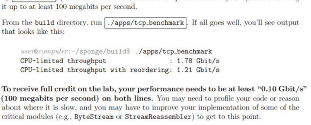
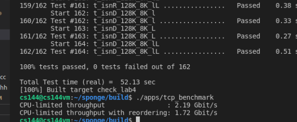

### 计算机网络-CS144

#### 介绍:

 - CS144是斯坦福计算计网络的课程,配套的实验就是实现计网中的几个核心协议,包括TCP,ARP,路由转发等。
 - 课程主页:https://cs144.github.io/ 
 - 测试点也比较给力,很多小细节(,通过所有测试点后,可以对自己设计实现的TCP吞吐量进行一个测试.
 - 由于课程要求,正式实习后会设仓库为私有。

######  - 课程示例:

###### - 我的成绩:

#### 实验内容:

   - lab0:预热,用shell实现http请求。
   - lab1:实现字节缓冲流,与上层应用传递数据的桥梁。
   - lab2:接收端Reciver,实现流重组器,流控制等。
   - lab3:发送端Sender,实现超时重传,ACK确认等。
   - lab4:TCP控制器,整合lab1-lab3,实现连接管理,完成TCP接口。
   - lab5:ARP协议。
   - lab6:路由转发协议。
     
